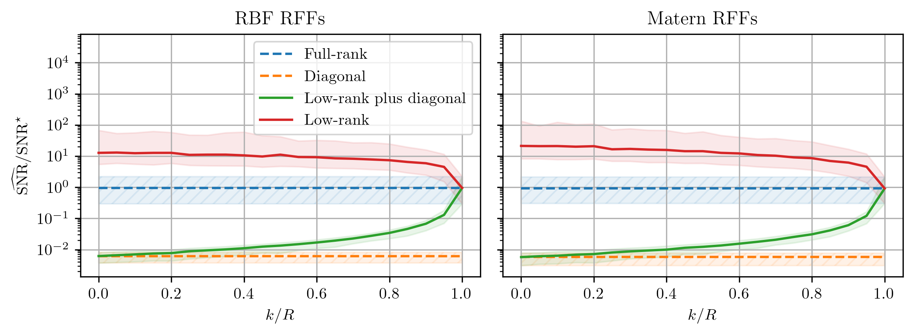

# Occams-razor

[Occam's Razor is Only as Sharp as Your ELBO]() by Anonymous 

Figure 1: Rank of the approximate posterior covariance $k \in (0, 1{,}024)$ divided by the number of features $R$ (x-axis) vs. estimated $\widehat{\text{SNR}}$ divided by the data-generating $\text{SNR}^\star$ (y-axis, $\text{ideal}=1$). Task: Bayesian linear regression on $N=20$ synthetic data points (Sec.~\ref{sec:experiments}). We estimate the approximate posterior's mean, covariance, and hyperparameters. \textbf{The ELBO can under or overestimate the SNR depending on the assumed covariance matrix structure.}

